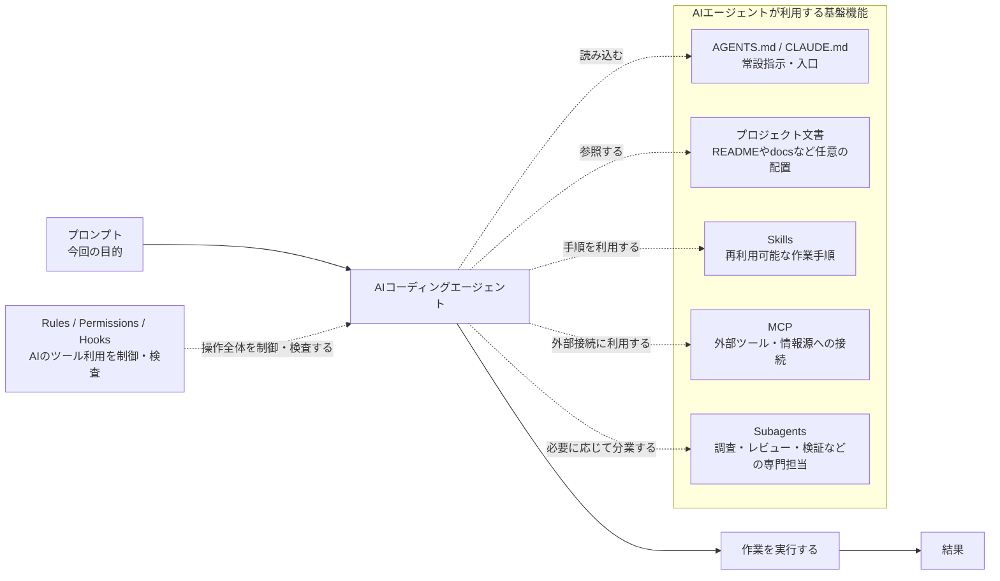
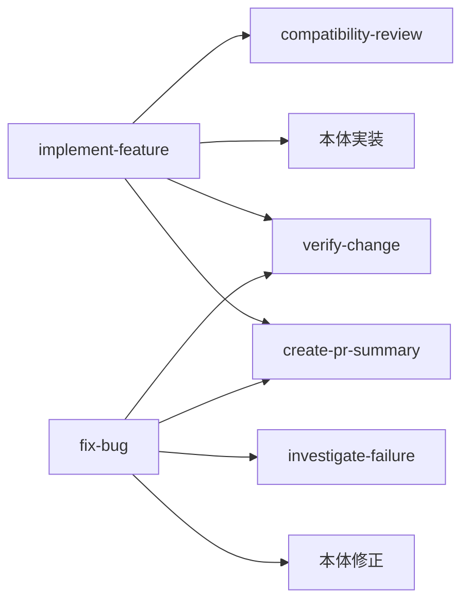
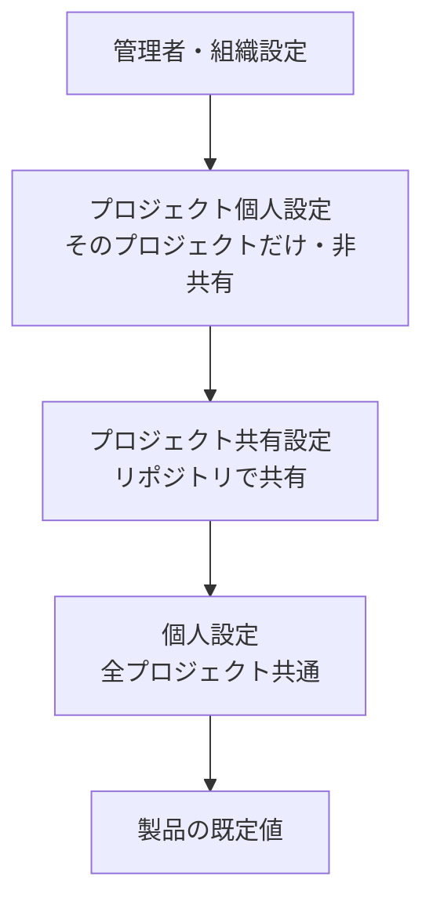
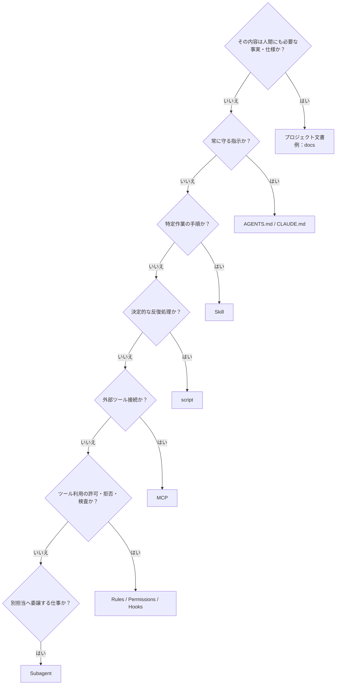

# AIコーディングエージェント開発基盤 導入ガイド

*Codex・Claude Codeを中心とした基礎概念と実装イメージ*

作成日：2026年7月13日  
対象：AIアシスタント主導の開発基盤を導入する開発者

## 0. 本書の結論

### 結論

AIコーディングエージェントの導入で最初に整備すべきものは、詳細なプロンプト集ではない。人間とAIが共有するプロジェクト文書を知識の本体とし、`AGENTS.md`／`CLAUDE.md`を入口、Skillsを作業手順、MCPを外部接続、Rules・Permissions・HooksをAI側の制御、Subagentsを専門分業として分離する構成が基本となる。

### 詳細

本書のゴールは、各製品の全機能を暗記することではない。AIアシスタント主導の開発基盤を導入するときに、何をどこへ置き、どの機能をどの場面で使うかを判断できる状態を作ることである。細かな仕様や最新の設定項目は、末尾の公式参考リンクへ委ねる。

| 要素                        | 一言で表す役割             | 代表例                             |
|-----------------------------|----------------------------|------------------------------------|
| プロンプト                  | 今回の目的を伝える         | 「認証機能を追加せよ」             |
| プロジェクト文書            | プロジェクト知識の本体     | `README`、`docs/`、要件、設計、規約、運用 |
| `AGENTS.md` / `CLAUDE.md`   | AIが最初に読む案内板       | 必読資料、絶対条件、検証コマンド   |
| Skills                      | 再利用可能な作業手順       | 新規開発、障害調査、変更検証       |
| MCP                         | 外部ツール・情報源への接続 | GitHub、社内文書、ローカルAPI      |
| Rules / Permissions / Hooks | AIの操作を制御・検査する   | コマンド拒否、実行前検査           |
| Subagents                   | 専門担当へ分業する         | 調査担当、レビュー担当、テスト担当 |



図1　AIコーディングエージェント開発基盤の全体像

本書でいう「プロジェクト文書」は概念上の分類であり、`docs/`はその配置例である。`docs/`はCodexやClaude Codeが予約・自動探索するディレクトリではない。一方、`AGENTS.md`、`.agents/skills/`、`CLAUDE.md`、`.claude/skills/`などは、各製品が所定の用途で認識する名前・配置である。

## 目次

1. AIコーディングエージェントを構成する機能
2. ドキュメントを知識の本体にする
3. `AGENTS.md`と`CLAUDE.md`
4. Skillsによる作業手順の再利用
5. MCPによる外部ツール接続
6. Rules・Permissions・HooksによるAI側制御
7. Subagentsによる専門分業
8. 個人・プロジェクト個人・プロジェクト設定
9. CodexとClaude Codeの対応関係
10. 推奨フォルダ構成と実装例
11. 導入手順
12. アンチパターンと判断基準
13. 公式参考リンク

## 1. AIコーディングエージェントを構成する機能

結論として、AIエージェント向け機能は「知識」「指示」「手順」「接続」「制御」「分業」に分けて理解するとよい。製品ごとのファイル名は異なるが、目的はほぼ共通である。

| 分類     | 目的                                   | 主な機能                  | 判断の目安                       |
|----------|----------------------------------------|---------------------------|----------------------------------|
| 知識     | プロジェクトの事実を保持する           | `README`、設計文書、要件文書など | 人間にも読ませる内容か      |
| 指示     | 毎回守る方針を伝える                   | `AGENTS.md`、`CLAUDE.md`  | すべてのタスクに関係するか       |
| 手順     | 特定作業を再現可能にする               | Skills                    | 複数工程を繰り返すか             |
| 接続     | 外部の情報・操作を利用する             | MCP                       | リポジトリ外へアクセスするか     |
| 制御     | ツール呼び出しを許可・拒否・検査する   | Rules、Permissions、Hooks | 自然言語指示より強い制御が必要か |
| 分業     | 専門タスクを別のコンテキストへ委譲する | Subagents                 | 調査やレビューを分離したいか     |

### 1.1 プロンプトは「今回の目的」だけを書く

毎回のプロンプトには、そのタスクだけに固有の目的・範囲・完了条件を書く。全プロジェクト共通の好みやプロジェクト固有の設計規約まで毎回繰り返す必要はない。

#### プロンプト例

```text
続行判定ユースケースを追加する。
既存の判定結果型を利用し、公開APIの互換性を維持する。
実装・テスト・ドキュメント更新までを完了条件とする。
```

### 1.2 役割分担の基本ルール

- 事実・仕様・理由はプロジェクトで定めた文書置き場へ置く。本書では`docs/`を例として用いる。
- 常に守る最重要指示は`AGENTS.md`または`CLAUDE.md`へ置く。
- 特定作業の手順はSkillへ置く。
- 外部サービスへの接続定義はMCP設定へ置く。
- コマンドやツール呼び出しの制御はRules・Permissions・Hooksへ置く。
- 調査やレビューを別担当へ切り出す場合はSubagentを使う。

## 2. ドキュメントを知識の本体にする

本書では、`README`とプロジェクト文書を人間・AI共通のSource of Truth（ソース・オブ・トゥルース）とし、AI固有ファイルを薄い入口にする構成を推奨する。AI専用の設計書を別に持つと、人間向け資料との内容差が発生するためである。

`docs/`という名前や、その配下のフォルダ構成は製品仕様ではない。既存の`documentation/`、`design/`、Wikiなどを利用してもよく、AIに参照させる場合は`AGENTS.md`や`CLAUDE.md`から参照先を明示する。

### 2.1 フォルダ構成と責務の一例

以下は、本書が例として採用するフォルダ構成である。CodexやClaude Codeが要求する構成ではなく、プロジェクトの規模や既存の文書体系に合わせて名前・分類・階層を変更できる。

| 配置                  | 責務                 | 主な内容                               |
|-----------------------|----------------------|----------------------------------------|
| `README.md`           | 人間向けの最短入口   | 目的、起動方法、主要リンク             |
| `docs/README.md`      | ドキュメント索引     | 分類、各文書の説明、優先順位           |
| `docs/requirements/`  | 要件・ユースケース   | 目的、入力、出力、境界条件             |
| `docs/architecture/`  | 設計の本体           | 依存方向、モジュール境界、データフロー |
| `docs/development/`   | 開発ルール           | コーディング、テスト、コマンド         |
| `docs/decisions/`     | 設計判断の履歴       | ADR、採用理由、棄却案                  |
| `docs/agent-workflows/` | 製品非依存の作業手順 | 新規開発、変更検証、障害調査          |

### 2.2 文書の優先順位を明示する

複数の資料や既存コードが矛盾したとき、AIに推測させてはならない。優先順位と矛盾時の行動を`AGENTS.md`／`CLAUDE.md`へ明記する。

次の記載例は、2.1のフォルダ構成を採用した場合の例であり、`docs/requirements/`などが製品によって自動認識されることを意味しない。

#### 記載例

```markdown
## 情報の優先順位
1. 現在のタスクで明示された要件
2. docs/requirements/ 配下の仕様
3. docs/decisions/ 配下の採用済みADR
4. docs/architecture/ 配下の設計
5. 既存実装
矛盾を発見した場合は推測で解消せず、矛盾箇所と影響範囲を報告する。
```

### 2.3 ドキュメント更新条件を決める

- 外部から観測可能な挙動を変更した場合は、要件・仕様を更新する。
- 依存方向、モジュール境界、公開インタフェースを変更した場合は、設計文書を更新する。
- ビルド・テスト・起動コマンドを変更した場合は、開発文書と`README`を更新する。
- 内部実装だけのリファクタリングで、挙動も設計も変わらない場合は原則として更新しない。

## 3. `AGENTS.md`と`CLAUDE.md`

結論として、`AGENTS.md`と`CLAUDE.md`はAI向けのブートストラップ文書である。詳細な仕様書ではなく、プロジェクト概要、必読資料、最重要ルール、検証方法、不明時の行動を短く記載する。

### 3.1 Codexの`AGENTS.md`

Codexは開始時にグローバルとプロジェクト階層の`AGENTS.md`を読み、作業ディレクトリに近いものまで指示チェーンを構築する。各ディレクトリでは`AGENTS.override.md`が`AGENTS.md`より先に選択される。これはアクセス制御ではなく、モデルへ与えるコンテキストである。

#### `AGENTS.md`の最小例

```markdown
# AGENTS.md

## プロジェクト
このリポジトリはTypeScriptモノレポである。

## 必読資料
- 変更前に `docs/README.md` から関連文書を特定する。
- アーキテクチャ変更時は `docs/architecture/` を読む。

## 必須ルール
- 機能間で実装パッケージを直接参照しない。
- 状態のスコープを必要最小限にする。
- 要求外のファイルを変更しない。
- テストを弱めて実装を通してはならない。

## 検証
コード変更後は `npm run check` を実行する。
実行していない検証を成功したと報告してはならない。

## 不明時の行動
仕様・文書・既存実装が矛盾する場合は、推測せず矛盾を報告する。
```

### 3.2 Claude Codeの`CLAUDE.md`

Claude Codeは`CLAUDE.md`を読み込む。既存の`AGENTS.md`を共通化したい場合、`CLAUDE.md`から`@AGENTS.md`として取り込める。Claude Code固有の指示だけを後ろへ追加する構成が簡潔である。

#### `CLAUDE.md`の共通化例

```markdown
@AGENTS.md

## Claude Code固有
- 複雑な変更では、実装前に計画を提示する。
- プロジェクト固有Skillは `.claude/skills/` から利用する。
```

### 3.3 書くべき内容・書かない内容

| 書くべき内容                 | 書かない方がよい内容     |
|------------------------------|--------------------------|
| プロジェクトの短い説明       | 長大な要件定義書全文     |
| 必読ドキュメントの入口       | 今回だけのタスク仕様     |
| 破ってはいけない最重要ルール | 細かな作業手順の全工程   |
| ビルド・テスト・検証コマンド | 頻繁に変わる一時情報     |
| 矛盾や不明点がある場合の行動 | 同じ規則の重複コピー     |

#### 重要

`AGENTS.md`と`CLAUDE.md`は「守るよう指示する機能」であり、厳密な拒否機構ではない。ツール実行を制御する場合はRules・Permissions・Hooksを使う。

## 4. Skillsによる作業手順の再利用

結論として、Skillは「特定の仕事を再現可能にするパッケージ」である。常設ルールではなく、発火条件、必要な資料、作業順序、判断基準、検証、完了報告をまとめる。

### 4.1 基本構造

#### CodexのSkill構造例

```text
.agents/skills/verify-change/
├─ SKILL.md
├─ scripts/
│  └─ run-check.ps1
├─ references/
│  └─ verification-policy.md
└─ assets/
   └─ report-template.md
```

Skillは`SKILL.md`を必須とし、必要に応じてscripts、references、assetsなどを同梱する。Codexは最初にSkillの名前・説明・パスだけを認識し、使用を決めた段階で全文を読む。Claude Codeも同様に`SKILL.md`を中心として構成する。

### 4.2 日本語の`SKILL.md`例

#### `SKILL.md`例

```markdown
---
name: verify-change
description: コード・テスト・ビルド設定を変更した後に、必要な検証を選択して実行し、結果を報告する。
---

# 変更検証

## 必読資料
- `docs/development/testing.md`
- `docs/development/commands.md`

## 手順
1. 変更差分を確認し、影響するパッケージを特定する。
2. 変更範囲に応じた型検査・静的解析・テストを選択する。
3. 検証コマンドを実行する。
4. 失敗が変更に起因する場合は修正し、再実行する。
5. 最後に全体検証を実行する。

## 完了報告
- 実行したコマンド
- 成否
- 未実施の検証と理由
- 残存リスク
```

### 4.3 Skill化の判断基準

| 対象                                         | 配置先                     | 理由                         |
|----------------------------------------------|----------------------------|------------------------------|
| 「constを優先する」などの常設規則            | `AGENTS.md`／`CLAUDE.md`・プロジェクト文書 | 独立した仕事ではない |
| 「後方互換性とは何か」という知識             | プロジェクト文書           | 人間とAIで共有する事実である |
| 変更差分を分析し、検証を選び、結果を報告する | Skill                      | 判断を含む独立した作業である |
| 決められたコマンドを順番に実行するだけ       | script                     | 決定的な処理である           |
| PR本文の定型文                               | assets／template           | 再利用する素材である         |

### 4.4 Skillの再利用と合成

Skill同士にクラス継承のような厳密な機構があると考えるべきではない。上位Skillが別Skillの実行を指示する「合成」として扱う。共通部分が単なる知識ならプロジェクト文書、決定的処理ならscriptへ分離する。

#### Skill合成の概念例



- 上位Skillは工程の組み立てを担当する。
- 下位Skillは単独で意味のある入力・出力を持つ。
- 依存方向は「オーケストレーションSkill → 専門Skill → プロジェクト文書／scripts」とする。
- 循環参照を作らない。
- 必ず実行すべき横断Skillは、`AGENTS.md`／`CLAUDE.md`にも条件を記載する。

### 4.5 Skillディレクトリの管理

独立Skillは、公式例に沿ってskills直下へフラットに置く構成が単純である。Skill内部のreferencesやscriptsは自由にネストできる。カテゴリ分けが必要なら、物理ネストより名前とSkillカタログで管理する方が、製品間の差を受けにくい。

#### 推奨するフラット構成

```text
.agents/skills/
├─ implement-feature/
├─ enhance-feature/
├─ fix-bug/
├─ verify-change/
└─ create-pr-summary/
```

## 5. MCPによる外部ツール接続

結論として、MCPはAIから外部ツールや情報源を利用するための共通接続規格である。拡張機能は必須ではなく、CLIまたは設定ファイルだけでも接続できる。CodexとClaude Codeは同じMCPサーバを利用できるが、クライアント側の設定形式は異なる。

### 5.1 接続方式

| 方式            | 特徴                                                           | 典型用途                                    |
|-----------------|----------------------------------------------------------------|---------------------------------------------|
| STDIO           | AIクライアントがローカルプロセスを起動し、標準入出力で通信する | npmパッケージ型、ローカルCLI型MCP           |
| Streamable HTTP | 起動済みのHTTPエンドポイントへ接続する                         | ローカル常駐サーバ、社内サーバ、クラウドMCP |

### 5.2 Codexの設定例

#### Codexの`config.toml`例

```toml
# ~/.codex/config.toml または <project>/.codex/config.toml
[mcp_servers.project_tools]
url = "http://localhost:8081/mcp"
[mcp_servers.context7]
command = "npx"
args = ["-y", "@upstash/context7-mcp"]
```

#### Codex CLIでの登録・確認例

```cmd
codex mcp add project-tools --url http://localhost:8081/mcp
codex mcp list
```

1行目はローカルHTTP型MCPサーバを登録する。2行目は登録済みサーバ一覧を表示する。IDE拡張やデスクトップアプリの画面から追加する方法もあるが、画面は必須ではない。

### 5.3 Claude Codeの設定例

#### Claude Codeの`.mcp.json`例

```json
{
  "mcpServers": {
    "project-tools": {
      "type": "http",
      "url": "http://localhost:8081/mcp"
    }
  }
}
```

#### Claude Code CLIでの登録例

```cmd
claude mcp add --transport http project-tools --scope project http://localhost:8081/mcp
```

このコマンドは、プロジェクト共有スコープのMCP設定を登録する。Claude Codeにはuser、local、projectの3スコープがある。

### 5.4 ローカルHTTP型の注意点

- localhostは、Codex／Claude Codeが実行されている環境自身を指す。
- Dev Container内でAIクライアントを動かす場合、localhostはコンテナを指す。
- ホスト側でMCPサーバを動かす場合は、host.docker.internalなど環境に応じた接続先を使う。
- HTTPサーバは別途起動しておく。STDIO方式ではクライアントがプロセスを起動する。
- 認証情報を必要とする場合は、設定ファイルへ直接埋め込まず環境変数やOAuthを利用する。

### 5.5 MCP・Skill・Subagentの違い

| 機能     | 役割                         | 例                                         |
|----------|------------------------------|--------------------------------------------|
| MCP      | 外部の手足を提供する         | GitHub Issueを取得する、社内文書を検索する |
| Skill    | 手足を使う作業手順を提供する | Issueを分析して修正計画を作る              |
| Subagent | 別担当として作業を実行する   | セキュリティ担当がMCPで脆弱性情報を調べる  |

## 6. Rules・Permissions・HooksによるAI側制御

結論として、`AGENTS.md`やSkillsはモデルへの指示であり、厳密な制御ではない。AIのツール呼び出しを許可・確認・拒否したい場合は、CodexではRulesとHooks、Claude CodeではPermissionsとHooksを使う。

### 6.1 Codex Rules

Codex Rulesは、サンドボックス外で実行しようとするコマンドを接頭辞で判定し、allow、prompt、forbiddenを設定する実験的機能である。複数Ruleが一致した場合は、forbidden、prompt、allowの順で厳しい判定が優先される。

#### Codex Rules例

```python
prefix_rule(
    pattern = ["git", "push"],
    decision = "forbidden",
    justification = "リモートへのpushは人間が実行する。",
    match = [
        "git push",
        "git push origin main",
    ],
    not_match = [
        "git status",
    ],
)
```

### 6.2 Claude Code Permissions

#### Claude CodeのPermissions例

```json
{
  "permissions": {
    "allow": [
      "Bash(npm run test *)"
    ],
    "ask": [
      "Bash(git commit *)"
    ],
    "deny": [
      "Bash(git push *)",
      "Read(./.env)"
    ]
  }
}
```

Permissionsは、BashコマンドやReadなどのツール利用に対して許可、確認、拒否を設定する。設定スコープごとの規則は結合され、拒否規則が存在する操作を、より下位の許可で単純に解除できるとは限らない。

### 6.3 Hooks

Hooksは、セッション開始、ツール実行前、ツール実行後、終了時などのイベントに独自処理を差し込む機能である。PreToolUseでは、ツール入力を検査して拒否したり、追加コンテキストを与えたりできる。

| イベント例     | 用途                                              |
|----------------|---------------------------------------------------|
| SessionStart   | プロジェクト情報やセッションメモを読み込む        |
| PreToolUse     | コマンド・ファイル編集・MCP呼び出しを事前検査する |
| PostToolUse    | 実行結果を監査・整形・記録する                    |
| Stop           | 終了前に検証漏れや報告形式を確認する              |

#### 限界

HookはAI固有の柔軟なガードレールであるが、製品がHook対象として公開するツール経路に依存する。したがって、`AGENTS.md`より強いが、万能なポリシー言語ではない。

### 6.4 使い分け

| 要件                                     | 適切な機能                                 |
|------------------------------------------|--------------------------------------------|
| 理由や代替手順も含めてAIへ説明する       | `AGENTS.md`／`CLAUDE.md`                   |
| 特定コマンドを許可・確認・拒否する       | Codex Rules／Claude Permissions            |
| ブランチ名や変更対象を見て動的に判定する | PreToolUse Hook                            |
| 実行後に結果を監査する                   | PostToolUse Hook                           |
| MCPの特定ツールをAIへ見せない            | MCPのenabled／disabled設定または製品側設定 |

## 7. Subagentsによる専門分業

結論として、Subagentは「手順」ではなく「別の担当者」である。メインエージェントとコンテキスト、ツール、モデル、指示を分けて、調査・レビュー・検証などを委譲する。

| 利用例               | Subagentが担う仕事                       | メイン側の仕事         |
|----------------------|------------------------------------------|------------------------|
| コードベース調査     | 関連ファイルと既存パターンを探索する     | 実装方針を決める       |
| セキュリティレビュー | 入力検証・認証・秘密情報の問題を列挙する | 修正優先度を判断する   |
| テストレビュー       | 不足ケースと脆いテストを指摘する         | 実装・テストを修正する |
| ドキュメント同期     | 変更に影響する文書を特定する             | 更新範囲を承認する     |

### 7.1 Skillとの違い

- Skillは作業手順であり、同じエージェントが読むこともできる。
- Subagentは別コンテキストで動く専門担当である。
- SubagentにSkillを事前読み込みさせる構成も可能である。
- 単純な数手の作業をSubagent化すると、伝達コストが増える。
- 独立して調査でき、出力契約が明確な仕事ほどSubagentに向く。

### 7.2 Claude CodeのSubagent例

#### Claude CodeのSubagent定義例

```markdown
---
name: code-reviewer
description: 変更差分を読み、バグ・互換性問題・テスト不足を報告する。
tools: Read, Grep, Glob
model: sonnet
---
あなたはコードレビュー担当である。
ファイルを変更せず、重大度順に問題を報告する。
各指摘には根拠となるファイルと位置、想定される影響、修正方針を含める。
```

## 8. 個人・プロジェクト個人・プロジェクト設定

結論として、設定は「個人」「プロジェクト共有」「プロジェクト個人」の3層で考えるとよい。ただし、3層すべてを正式なスコープとして持つかは製品・機能ごとに異なる。



図2　設定スコープの考え方

図2は設定を整理するための概念図であり、全製品・全機能に共通する正式なスコープ名や優先順位を示すものではない。実際のスコープ、探索場所、優先順位は製品と機能ごとに異なる。

### 8.1 スコープの意味

| スコープ             | 適用範囲                       | 共有      | 用途                                         |
|----------------------|--------------------------------|-----------|----------------------------------------------|
| 個人設定             | 自分の全プロジェクト           | しない    | 言語、好み、汎用Skill、汎用MCP               |
| プロジェクト設定     | そのリポジトリの全利用者       | Gitで共有 | アーキテクチャ、検証、チームSkill、チームMCP |
| プロジェクト個人設定 | そのリポジトリにおける自分だけ | しない    | ローカルURL、実験設定、個人用補助ツール      |

### 8.2 代表的配置例

本書の個人設定パスにある`~`は、実行環境のホームディレクトリを表す。Windowsネイティブ環境では通常`%USERPROFILE%`（`C:\Users\<user>`）、LinuxおよびWSLでは通常`$HOME`（`/home/<user>`）、macOSでは通常`/Users/<user>`に対応する。例えばWindowsでは、`~/.claude/CLAUDE.md`は通常`C:\Users\<user>\.claude\CLAUDE.md`を指す。WSL上の`~`はWindows側のユーザーディレクトリではなく、WSL内のホームディレクトリを指す。

#### 8.2.1 Codex

次の表には、Codexが認識する配置と、専用スコープがない場合の運用例が含まれる。すべての欄が製品の正式な設定スコープを表すわけではない。

| 機能      | 個人                    | プロジェクト共有             | プロジェクト個人                                      | 備考                                      |
|-----------|-------------------------|------------------------------|-------------------------------------------------------|-------------------------------------------|
| 指示      | `~/.codex/AGENTS.md`    | `<repo>/AGENTS.md`           | 専用配置なし。必要なら未追跡ファイルなどで運用        | 配置階層に応じて指示を連結する            |
| 設定・MCP | `~/.codex/config.toml`  | `<repo>/.codex/config.toml`  | 選択プロファイルやCLI上書きを利用                     | MCPは`codex mcp add`でも登録できる         |
| Skills    | `~/.agents/skills/`     | `<repo>/.agents/skills/`     | `<repo>/.agents/skills/`をGit管理外にして運用         | `SKILL.md`を配置する                       |
| Hooks     | `~/.codex/hooks.json`   | `<repo>/.codex/hooks.json`   | `<repo>/.codex/hooks.json`をGit管理外にして運用       | 複数階層のHookを併用できる                 |
| Rules     | `~/.codex/rules/`       | `<repo>/.codex/rules/`       | 専用配置なし。個人Ruleはユーザー層へ配置              | 一致時はより厳しい判断を優先する          |
| Subagents | `~/.codex/agents/`      | `<repo>/.codex/agents/`      | `<repo>/.codex/agents/`をGit管理外にして運用          | カスタムAgentを定義する                    |

Codexのconfig値は、CLI上書き、作業場所に近いプロジェクト設定、選択プロファイル、ユーザー設定の順で優先される。`AGENTS.md`は値の上書きではなく、グローバルから作業場所へ向けて指示が連結される。Hooksは複数階層のものが併存する。Rulesは一致した中で最も厳しい判断が優先される。

#### 8.2.2 Claude Code

次の表はClaude Codeの代表的な配置を整理したものである。機能ごとに利用できるスコープが異なり、空欄を補うための未追跡運用は本書の提案例である。

| 機能      | 個人                         | プロジェクト共有                  | プロジェクト個人                                                   | 備考                                      |
|-----------|------------------------------|-----------------------------------|----------------------------------------------------------------------|-------------------------------------------|
| 指示      | `~/.claude/CLAUDE.md`        | `<repo>/CLAUDE.md`                | `<repo>/CLAUDE.local.md`                                           | `CLAUDE.local.md`は通常Git管理外           |
| 一般設定・Permissions・Hooks | `~/.claude/settings.json` | `<repo>/.claude/settings.json` | `<repo>/.claude/settings.local.json`                                | Local設定は通常Git管理外                  |
| MCP       | `~/.claude.json`             | `<repo>/.mcp.json`                | `~/.claude.json`の`projects["<repoの絶対パス>"].mcpServers`        | `claude mcp add`でも登録できる             |
| Rules     | `~/.claude/rules/`           | `<repo>/.claude/rules/`           | 専用配置なし。必要なら未追跡運用                                   | Markdownファイルで分割できる              |
| Skills    | `~/.claude/skills/`          | `<repo>/.claude/skills/`          | 専用配置なし。必要なら未追跡運用                                   | `SKILL.md`を配置する                       |
| Subagents | `~/.claude/agents/`          | `<repo>/.claude/agents/`          | 専用配置なし。必要なら未追跡運用                                   | Markdownファイルで定義する                |

Claude Codeの一般設定は、管理設定、CLI、Local、Project、Userの順で優先される。`CLAUDE.md`と`CLAUDE.local.md`は連結され、同じ階層ではlocalが後に読まれる。MCPはLocal、Project、Userの3スコープを明示的に持つ。

### 8.3 同名定義は避ける

同名Skill、同名MCP、同名Subagentの競合規則は機能・製品で異なる。意図的な上書きを除き、ユーザー設定とプロジェクト設定で同じ名前を使わない方がよい。名前には用途やプロジェクト名を含める。

#### 命名例

```text
個人Skill: generic-code-review
プロジェクトSkill: jugg-navi-domain-review
個人MCP: openai-docs
プロジェクトMCP: jugg-navi-project-tools
```

## 9. CodexとClaude Codeの対応関係

結論として、概念の大半は共通であるが、ファイル名・設定形式・優先順位・製品固有拡張は異なる。同じMCPサーバや共通のプロジェクト文書は再利用しやすいが、制御設定をそのまま共有できるとは限らない。

| 目的         | Codex                            | Claude Code                      | 共通化方針                         |
|--------------|----------------------------------|----------------------------------|------------------------------------|
| 常設指示     | `AGENTS.md`                      | `CLAUDE.md`                      | `CLAUDE.md`から`@AGENTS.md`を取り込む |
| Skill        | `.agents/skills/<name>/SKILL.md` | `.claude/skills/<name>/SKILL.md` | 本文を共通文書へ分離する。本書の例は`docs/agent-workflows/` |
| MCP          | `.codex/config.toml`             | `.mcp.json`／`~/.claude.json`    | 同じサーバを別設定で登録する       |
| コマンド制御 | `.codex/rules/*.rules`           | `.claude/settings.json`のPermissions | 目的だけ共有し設定は分ける      |
| イベント処理 | `.codex/hooks.json`または`config.toml` | `.claude/settings.json`のHooks | スクリプト本体は共有し設定は分ける |
| Subagent     | `.codex/agents/*.toml`           | `.claude/agents/*.md`            | 役割定義は共有し形式は分ける       |

### 9.1 共通化しやすいもの

- `README`などのプロジェクト文書に置いた要件・設計・規約・作業手順
- MCPサーバそのもの
- HookやSkillから呼ぶ検証スクリプト
- Subagentへ渡すレビュー観点や出力契約
- `AGENTS.md`を本体とし、`CLAUDE.md`から取り込む常設指示

### 9.2 共通化しない方がよいもの

- Codexの`config.toml`とClaude Codeの`settings.json`
- Codex RulesとClaude Code Permissions
- 製品固有のSkillフロントマターや動的挿入機能
- Subagent定義ファイルの形式
- 同名設定の優先順位へ依存する設計

## 10. 推奨フォルダ構成と実装例

本書では、プロジェクト文書を中心に置き、製品固有ファイルは薄い入口として配置する。以下は導入時の構成例であり、製品が要求する完全な構成や必須ファイルの一覧ではない。`docs/`、`tools/agent/`、`src/`などは本書が例として選んだ名前であり、各製品の予約ディレクトリではない。

### 10.1 Codexのみを使う構成例

#### 本書で説明した機能を含むCodex構成例

MCP、モデル、サンドボックス、承認、Subagent全体設定などは`config.toml`へ置く。Hooksは`hooks.json`または`config.toml`のどちらかで定義できるが、次の例では役割を見分けやすくするため`hooks.json`へ分離する。

```text
project/
├─ README.md
├─ AGENTS.md                         # 常設指示・参照先・検証方法
├─ docs/
│  ├─ README.md
│  ├─ requirements/
│  ├─ architecture/
│  ├─ development/
│  ├─ decisions/
│  └─ agent-workflows/              # 製品非依存の作業手順
├─ .agents/
│  └─ skills/
│     ├─ implement-feature/
│     │  └─ SKILL.md
│     └─ verify-change/
│        └─ SKILL.md
├─ .codex/
│  ├─ config.toml                   # 一般設定・MCP・Subagent全体設定
│  ├─ hooks.json                    # ライフサイクルHook
│  ├─ rules/
│  │  └─ default.rules             # コマンドの許可・確認・拒否
│  └─ agents/
│     ├─ code-reviewer.toml         # カスタムSubagent
│     └─ test-reviewer.toml
├─ tools/
│  └─ agent/
│     ├─ pre-tool-check.ps1         # Hookから呼ぶ共通スクリプト
│     └─ run-verification.ps1       # Skillから呼ぶ検証スクリプト
└─ src/
```

`config.toml`の`[mcp_servers.<name>]`にMCP接続を、`[agents]`にSubagentの同時実行数や深さなどを記載する。個々のカスタムSubagentは`.codex/agents/*.toml`へ分離する。

### 10.2 Claude Codeのみを使う構成例

#### 本書で説明した機能を含むClaude Code構成例

Claude Codeでは、Permissions・Hooks・環境変数・モデルなどを`.claude/settings.json`へまとめる。Rules、Skills、Subagentsは`.claude/`配下の専用ディレクトリへ置き、プロジェクト共有MCPはリポジトリ直下の`.mcp.json`へ置く。

```text
project/
├─ README.md
├─ CLAUDE.md                        # 常設指示・参照先・検証方法
├─ CLAUDE.local.md                  # プロジェクト個人設定・Git管理外
├─ docs/
│  ├─ README.md
│  ├─ requirements/
│  ├─ architecture/
│  ├─ development/
│  ├─ decisions/
│  └─ agent-workflows/              # 製品非依存の作業手順
├─ .claude/
│  ├─ settings.json                 # 一般設定・Permissions・Hooks
│  ├─ settings.local.json           # プロジェクト個人設定・Git管理外
│  ├─ rules/
│  │  ├─ architecture.md            # トピック別・パス別の指示
│  │  └─ testing.md
│  ├─ skills/
│  │  ├─ implement-feature/
│  │  │  └─ SKILL.md
│  │  └─ verify-change/
│  │     └─ SKILL.md
│  └─ agents/
│     ├─ code-reviewer.md            # カスタムSubagent
│     └─ test-reviewer.md
├─ .mcp.json                         # プロジェクト共有MCP
├─ tools/
│  └─ agent/
│     ├─ pre-tool-check.ps1          # Hookから呼ぶ共通スクリプト
│     └─ run-verification.ps1        # Skillから呼ぶ検証スクリプト
└─ src/
```

### 10.3 CodexとClaude Codeを併用する構成

#### 本書で説明した機能を含む併用構成

併用時は、共通知識と決定的なスクリプトを共有し、製品が認識する入口・設定・制御ファイルだけを分ける。

```text
project/
├─ README.md
├─ AGENTS.md                    # 共通指示の本体
├─ CLAUDE.md                    # @AGENTS.md + Claude固有指示
├─ docs/
│  ├─ README.md
│  ├─ requirements/
│  ├─ architecture/
│  ├─ development/
│  ├─ decisions/
│  └─ agent-workflows/         # 製品非依存の手順本体
├─ .agents/
│  └─ skills/                   # Codex用の薄いSkill入口
├─ .claude/
│  ├─ settings.json             # ClaudeのPermissions・Hooks・一般設定
│  ├─ settings.local.json       # Git管理外
│  ├─ rules/                    # Claudeのトピック別・パス別指示
│  ├─ skills/                   # Claude用の薄いSkill入口
│  └─ agents/                   # ClaudeのカスタムSubagents
├─ .codex/
│  ├─ config.toml               # Codexの一般設定・MCP・Agent全体設定
│  ├─ hooks.json                # CodexのHooks
│  ├─ rules/                    # CodexのコマンドRules
│  └─ agents/                   # CodexのカスタムSubagents
├─ .mcp.json                    # Claudeのプロジェクト共有MCP
├─ tools/agent/                # 共通スクリプト
└─ src/
```

同じMCPサーバを使う場合でも、Codexは`.codex/config.toml`、Claude Codeは`.mcp.json`へそれぞれ接続情報を記載する。HooksとSubagent定義もファイル形式が異なるため、設定ファイル自体は分ける。

### 10.4 Skill本文の二重管理を避ける

Codex用とClaude Code用に同じ長文`SKILL.md`を複製すると、更新漏れが発生する。製品固有Skillは薄い入口とし、実際の手順を共通のプロジェクト文書へ置く。以下では、その配置例として`docs/agent-workflows/`を使用する。

#### 薄い`SKILL.md`例

```markdown
---
name: verify-change
description: 実装変更後の検証を行う。
---

`docs/agent-workflows/verify-change.md` を読み、その手順に従う。
```

### 10.5 ユーザー設定の配置例

#### Windowsでの個人設定例

```text
C:\Users\<user>\
├─ .codex\
│  ├─ AGENTS.md
│  ├─ config.toml
│  ├─ hooks.json
│  ├─ rules\
│  └─ agents\
├─ .agents\
│  └─ skills\
├─ .claude\
│  ├─ CLAUDE.md
│  ├─ settings.json
│  ├─ rules\
│  ├─ skills\
│  └─ agents\
└─ .claude.json                 # Claude Codeの個人MCP・アプリ状態など
```

## 11. 導入手順

結論として、最初からMCP・Hooks・Subagentsまで全部導入する必要はない。プロジェクト文書と常設指示を整え、繰り返し作業だけをSkill化し、必要になった時点で接続と制御を追加する。以下は本書が推奨する導入順であり、製品が要求するセットアップ手順ではない。

1. `README`と文書索引を作り、既存文書への入口を整理する。本書の構成例では文書索引を`docs/README.md`とする。
2. 要件・アーキテクチャ・開発コマンドの最低限を、プロジェクトで定めた文書置き場へ記載する。
3. `AGENTS.md`または`CLAUDE.md`を作り、必読資料・最重要ルール・検証コマンドだけを書く。
4. 毎回同じ手順を依頼している作業を一つ選び、最初のSkillを作る。
5. 変更検証をSkillまたは共通スクリプトとして整備する。
6. 外部サービスが必要になった段階でMCPを一つ接続する。
7. 自然言語指示では足りない操作だけRules・Permissions・Hooksで制御する。
8. 独立した調査・レビューが増えた段階でSubagentを導入する。
9. AIが同じ失敗を繰り返したときだけ、指示・Skill・プロジェクト文書を更新する。

### 11.1 最初の1週間で作るもの

| 優先度     | 作成物                       | 完成条件                                       |
|------------|------------------------------|------------------------------------------------|
| 1          | 文書索引（例：`docs/README.md`） | 必要な文書へ迷わず到達できる                |
| 2          | `AGENTS.md`または`CLAUDE.md` | 最重要ルールと検証コマンドが短くまとまっている |
| 3          | verify-change Skill          | 変更後の検証と報告を再現できる                 |
| 4          | プロジェクト固有MCP 1件      | CLIまたは設定ファイルから接続確認できる        |
| 5          | 必要最小限のRule／Permission | 禁止または確認したいAI操作が明示されている     |

## 12. アンチパターンと判断基準

| アンチパターン                      | 問題                                           | 改善                                         |
|-------------------------------------|------------------------------------------------|----------------------------------------------|
| `AGENTS.md`へ全仕様を書く           | 毎回コンテキストを消費し、更新箇所が不明になる | 詳細はプロジェクト文書へ置き、入口と最重要ルールだけ残す |
| Skillを単なる規約集にする           | 独立した作業として再利用できない               | 常設規則は指示ファイル、知識はプロジェクト文書へ移す |
| 同じ規則を複数ファイルへ複製する    | 内容が徐々にずれる                             | 本体を1か所にし、他は参照・要約にする        |
| Skillを細分化しすぎる               | 呼び出し判断と伝達コストが増える               | 入力・出力が独立する単位だけSkill化する      |
| Skill間を循環参照する               | 実行順と責任が不明になる                       | 上位→専門→プロジェクト文書／scriptsの一方向にする |
| 全タスクで全プロジェクト文書を読ませる | コンテキストを浪費する                      | 作業種別ごとに必読資料を選ぶ                 |
| CodexとClaudeの設定を完全共通化する | 製品固有仕様を隠蔽し、故障原因になる           | 共通知識とスクリプトだけ共通化する           |
| `AGENTS.md`を強制機構と考える       | モデルが指示を逸脱する可能性がある             | 必要な操作はRules・Permissions・Hooksで扱う  |

### 12.1 最終判断フロー

#### 配置先の判断フロー



## 13. 公式参考リンク

本章は、細かな仕様を確認するための公式資料一覧である。各リンクの後ろに、参照すべき内容を簡潔に記載する。製品仕様は更新されるため、実装前には最新の公式文書を確認する。

### 13.1 OpenAI Codex

- [Codex：AGENTS.md](https://learn.chatgpt.com/docs/agent-configuration/agents-md)：グローバル・プロジェクト・下位ディレクトリの指示探索順、`AGENTS.override.md`、確認方法を説明する。
- [Codex：Build skills](https://learn.chatgpt.com/docs/build-skills)：`SKILL.md`の構造、progressive disclosure、配置場所、Skill配布方法を説明する。
- [Codex：MCP](https://learn.chatgpt.com/docs/extend/mcp?surface=cli)：STDIOとStreamable HTTP、`config.toml`、CLI登録、OAuthなどの接続方法を説明する。
- [Codex：Rules](https://learn.chatgpt.com/docs/agent-configuration/rules)：コマンド接頭辞に対するallow・prompt・forbiddenと競合時の判定を説明する。
- [Codex：Hooks](https://learn.chatgpt.com/docs/hooks)：SessionStart、PreToolUse、PostToolUseなどのイベントと、ツール呼び出しの検査・拒否方法を説明する。
- [Codex：Config basics](https://learn.chatgpt.com/docs/config-file/config-basic)：ユーザー設定、プロジェクト設定、プロファイル、CLI上書きの優先順位を説明する。
- [Codex：Subagents](https://learn.chatgpt.com/docs/agent-configuration/subagents)：専門エージェントの定義、役割、ツール、利用方法を説明する。

### 13.2 Anthropic Claude Code

- [Claude Code：.claude directory](https://code.claude.com/docs/en/claude-directory)：`settings.json`、Rules、Skills、Subagents、`.mcp.json`などの配置と役割を説明する。
- [Claude Code：Memory / CLAUDE.md](https://code.claude.com/docs/en/memory)：`CLAUDE.md`、`CLAUDE.local.md`、`@import`、階層読み込み、`AGENTS.md`との共通化を説明する。
- [Claude Code：Skills](https://code.claude.com/docs/en/skills)：`SKILL.md`の作成、配置、発火、補助ファイル、製品固有フロントマターを説明する。
- [Claude Code：MCP](https://code.claude.com/docs/en/mcp)：HTTP・STDIO接続、user・local・projectスコープ、CLI登録方法を説明する。
- [Claude Code：Settings](https://code.claude.com/docs/en/settings)：Managed・User・Project・Localの設定スコープと優先順位、Permissionsを説明する。
- [Claude Code：Hooks](https://code.claude.com/docs/en/hooks)：PreToolUseなどのイベント、入力・出力形式、allow・deny・askの判断方法を説明する。
- [Claude Code：Subagents](https://code.claude.com/docs/en/sub-agents)：Subagentの配置、優先順位、ツール・モデル・Skill・メモリ設定を説明する。

### 13.3 読み進め方

1. 最初に本書の1章から5章を読み、役割分担と基本構成を理解する。
2. 実際に使う製品の`AGENTS.md`／`CLAUDE.md`とSkillsの公式資料を読む。
3. MCPを接続するときだけMCP公式資料の詳細設定を参照する。
4. 操作制御が必要になった時点でRules・Permissions・Hooksを参照する。
5. Subagentは、単一エージェントで調査・実装・レビューが混線したときに導入する。

## まとめ

AIアシスタント主導の開発基盤は、巨大なプロンプトを用意することではない。知識をプロジェクト文書へ集約し、AI向け入口を薄くし、繰り返し作業をSkill化し、外部接続をMCPへ分離し、必要な操作だけ制御し、独立した仕事だけをSubagentへ委譲することで成立する。

### 導入の最小単位

まずは文書索引（本書の例では`docs/README.md`）、`AGENTS.md`または`CLAUDE.md`、変更検証Skillの3点を作る。その後、必要性が確認できた機能だけを追加する。
